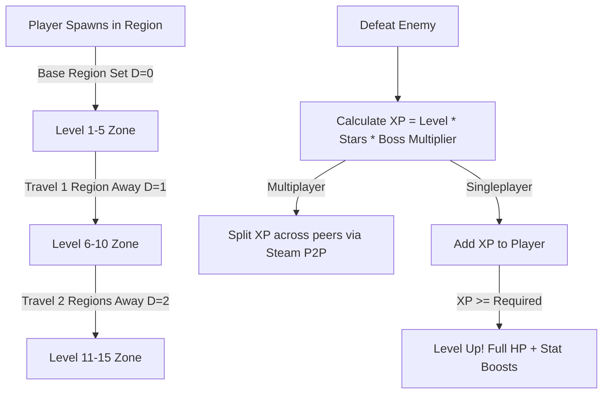

# 🔥 PyroProgression

<div align="center">

[](https://store.steampowered.com/app/1128000/Cube_World/)
[](docs/ARCHITECTURE.md)
[](#license)
[](https://github.com/thetrueoneshots/PyroProgression/releases)

**A complete RPG progression, XP, and levelling overhaul for the Cube World Steam release.**

[Features](#-key-features) • [Installation](#-installation) • [How It Works](#-how-it-works) • [Commands](#-commands) • [Documentation](#-documentation) • [Building from Source](#-building-from-source) • [Changelog](#-changelog) • [Credits](#-credits)

<br/>


</div>

---

## 📖 Overview

**PyroProgression** reintroduces the classic Alpha-style XP and leveling playstyle to the Cube World Steam release. 

Instead of relying solely on region-locked artifacts for character growth, PyroProgression implements a dynamic RPG leveling system where defeating monsters grants experience points, levels increase player attributes, equipment scales based on distance and level, and difficulty naturally ramps up as you explore further outward from your home region.

---

## ⚡ Key Features

- 🌟 **Classic XP & Leveling**: Earn XP by defeating enemies. Level up to increase Health, Damage, Crit, Haste, Armor, Resistance, and Stamina.
- 🗺️ **Dynamic World Scaling**: The farther a region is from your starting region (Chebyshev distance), the higher the levels of enemies, bosses, and loot.
  - Starting region features enemies from Level 1–5; each subsequent regional ring increases level range by +5.
- ⚔️ **Gear Level Requirements**: Gear drops with distinct item levels. You must meet the level requirement to equip gear.
- 🛡️ **Revamped Gear & Stat Scaling**: Weapons and armor feature custom logarithmic scaling curves and secondary stats (Crit, Haste, HP Regen).
- 💰 **Scaled Economy**: Gold drops from slain enemies and gold bag yields scale with enemy level and regional distance. Shop equipment costs scale with item level.
- 🌐 **Multiplayer XP Sharing**: In multiplayer sessions, XP from kills is evenly split across all connected players via Steam P2P networking.
- 📍 **Recenter Mechanism**: Settle in new regions with the `/recenter` chat command to calibrate difficulty around your new base.
- 🏷️ **Enhanced HUD**: Floating combat text for XP gains, level-up sound and visual FX, and region level banners displayed in the top-right HUD.

---

## 📥 Installation

### Prerequisites
- **Cube World (Steam Edition)** (x86_64)
- **CubeModLoader** ([Download latest release](https://github.com/thetrueoneshots/Cube-World-Mod-Launcher/releases))

### Quick Setup
1. Download the latest `PyroProgression_v.x.x.zip` from the [Releases page](https://github.com/thetrueoneshots/PyroProgression/releases).
2. Place `CubeModLoader.fip` into your root Cube World folder (where `cubeworld.exe` is located).
3. Create a folder named `Mods` in your Cube World root directory if it doesn't already exist.
4. Copy `PyroProgression.dll` into the `Mods/` folder.
5. Launch Cube World and enjoy!

```text
📁 Cube World/
├── 📄 cubeworld.exe
├── 📄 CubeModLoader.fip
└── 📁 Mods/
    └── 📄 PyroProgression.dll
```

> For comprehensive troubleshooting and multiplayer instructions, see the [Installation Guide](docs/guides/INSTALLATION.md).

---

## 🕹️ In-Game Commands

| Command | Description |
|---|---|
| `/recenter` | Sets your current region as the new home base ($D = 0$), re-centering creature and loot level scaling around your new location without player HP exploit. |

> Learn more about the mechanics in the [Recenter Command Guide](docs/features/RECENTER.md).

---

## 🧠 How It Works



### Progression Summary
- **XP Required**: $\text{XP}_{\text{req}}(\text{Level}) = 50 \times (1 + \text{Level}^{1.3})$
- **XP on Kill**: $\text{XP}_{\text{gain}} = \text{Level} \times \text{Stars} \times M_{\text{boss}}$ (World Boss = $10\times$, Named Boss = $5\times$, Mini Boss = $2\times$).
- **Distance Metric**: Chebyshev distance $D = \max(|X - X_0|, |Y - Y_0|)$.
- **Region Level Range**: $\text{Level}_{\text{min}} = 1 + 5D$, $\text{Level}_{\text{max}} = 5(D + 1)$.

> For all mathematical formulas, see the [Formulas & Scaling Reference](docs/FORMULAS.md).

---

## 📚 Documentation Suite

Extensive technical and user documentation is maintained in the [`docs/`](docs/) directory:

- 🏛️ **[Architecture & System Design](docs/ARCHITECTURE.md)**: DLL lifecycle, memory detours, hook orchestration, and subsystem structure.
- 📐 **[Formulas & Scaling Reference](docs/FORMULAS.md)**: Detailed breakdown of XP curves, creature logarithm scaling, gear formulas, and the `PyroRand` LCG.
- 🔍 **[Memory Hooks & Reverse Engineering](docs/HOOKS-AND-MEMORY.md)**: Memory offset catalogue, assembly trampolines (`ASM_*`), and calling conventions.
- 🛠️ **[Developer & Build Guide](docs/DEVELOPMENT.md)**: Building from source with CMake, compiler prerequisites, and debugging with Visual Studio.
- 🤝 **[Contributing Guidelines](docs/CONTRIBUTING.md)**: Code style, PR guidelines, and open-source contribution procedures.
- 🌐 **[Multiplayer Guide](docs/guides/MULTIPLAYER.md)**: Steam P2P packet structures and party synchronization mechanics.
- 📍 **[Recenter Feature Deep Dive](docs/features/RECENTER.md)**: How `/recenter` recalibrates world difficulty.
- 📦 **[Installation Guide](docs/guides/INSTALLATION.md)**: Step-by-step setup instructions for players.

---

## 🔨 Building from Source

### Requirements
- **Windows 10 / 11 (64-bit)**
- **CMake 3.8+**
- **C++ Compiler** with x86_64 inline assembly support (MSVC 2019/2022 or MinGW-w64 GCC/Clang)
- **[CWSDK](https://github.com/thetrueoneshots/cwsdk)** submodule

```bash
# Clone the repository and initialize submodules
git clone https://github.com/thetrueoneshots/PyroProgression.git
cd PyroProgression
git submodule update --init --recursive

# Compilar a DLL com um único comando:
make

# Ou via PowerShell / Batch:
.\build.ps1
# .\build.bat
```

A DLL compilada (`PyroProgression.dll`) é automaticamente gerada e copiada para a pasta `dist/`.

#### Comandos Úteis do Makefile:
- `make` ou `make build` — Compila a DLL em modo Release e copia para `dist/`
- `make test` — Compila e roda os testes unitários automatizados
- `make clean` — Limpa os diretórios de compilação (`build/` e `dist/`)


---

## 📜 Changelog

### `[v.1.5]` — Reverted Scaling & Region Names
- Reverted the XP system curve back to v.1.1 baseline.
- Increased shop gear purchase scaling costs.
- Rebalanced high-level gear stat progression.
- Top-right HUD region banner now displays the current regional level bracket.

### `[v.1.4]` — Star Rating Bug & Scaling Buffs
- Fixed a bug causing higher star/level items to yield worse stats than lower-tier items.
- Lowered XP gain and curve scaling factor for smoother progression pacing.
- Scaled up enemy, player, and gear attributes.
- Fixed a bug where `/recenter` displayed stale enemy HP values.

### `[v.1.3]` — Enemy & Player Scaling Updates
- Standardized enemy and item level ranges to $1\text{--}5 \times \text{distance}$.
- Reduced player and enemy baseline starting stats for balanced early-game difficulty.
- Fixed enemy attack speed calculation bugs.

### `[v.1.2]` — Multiplayer XP Sharing & Scaling Tweaks
- Added Steam P2P multiplayer XP distribution among party members.
- Re-tuned attribute scaling curves to prevent late-game arithmetic overflow.

### `[v.1.1]` — Level Number Formatting & Recenter Command
- Added formatting for large level values (`xxx`, `x.xxK`, and `x.xxM`).
- Introduced the `/recenter` chat command.

### `[v.1.0]` — Initial Release
- Initial public release of PyroProgression for Cube World Steam.

---

## 👥 Credits & Acknowledgments

- **Lead Developer**: `thetrueoneshots`
- **Inspiration & Mod Namesake**: `PyroThunderzz` — for pitching the concept and driving development forward.
- **Testing & Balancing**: `S.`, `2 AZ ToufouMaster`
- **Network Reverse Engineering**: `Andoryuuta` & `ChrisMiuchiz` ([Cube-World-Chat-Mod](https://github.com/ChrisMiuchiz/Cube-World-Chat-Mod))
- **Playtesters**: `CaterpillarCreditUnion`, `Coldurs`, `spenny`, `Shlomopoco`, `Nerah`, `mharr`, `Tabs`, and `TheBagel3`.
- **SDK**: Built with [CWSDK](https://github.com/thetrueoneshots/cwsdk).

---

## ⚖️ License

Distributed under the MIT License. See [LICENSE](LICENSE) or project repository for details. Cube World is a registered trademark of Picroma e.K. This mod is not affiliated with or endorsed by Picroma.
