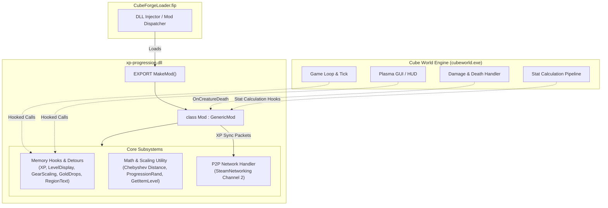
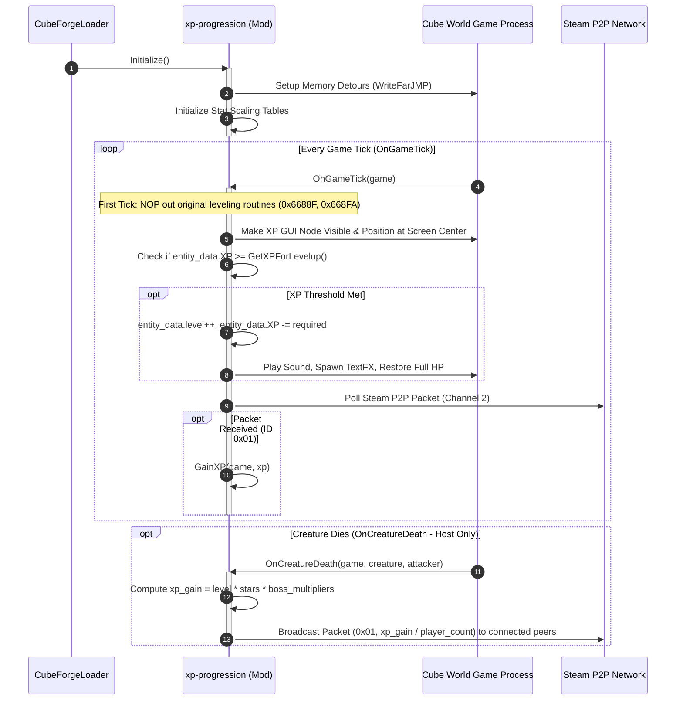

# Architecture & System Design

This document details the software architecture, execution lifecycle, memory manipulation techniques, and subsystem interactions in **xp-progression**.

---

## 🧭 Table of Contents
1. [Overview](#overview)
2. [Component Architecture](#component-architecture)
3. [Mod Lifecycle & Execution Flow](#mod-lifecycle--execution-flow)
4. [Memory Hooking & Assembly Trampolines](#memory-hooking--assembly-trampolines)
5. [Multiplayer & Steam P2P Synchronization](#multiplayer--steam-p2p-synchronization)
6. [Directory Structure](#directory-structure)

---

## Overview

xp-progression is a dynamic link library (`xp-progression.dll`) built for the x86_64 Windows release of **Cube World** (Steam edition). It interacts directly with the running game process (`cubeworld.exe`) via:
- **CWSDK (CubeForge SDK)**: An abstraction layer providing type definitions, game object layouts (`cube::Game`, `cube::Creature`, `cube::Item`, `plasma::Node`), and hook definitions (`GenericMod`).
- **In-Process Binary Patching & Detours**: Overwriting game bytecode at specific offsets with `jmp` instructions pointing to naked assembly trampolines.
- **Steamworks P2P API**: Intercepting and broadcasting custom P2P packets across players for multiplayer XP synchronization.



---

## Component Architecture

xp-progression is structured into several modular headers and translation units:

| Component | File(s) | Responsibility |
|---|---|---|
| **Core Entrypoint** | [`src/main.cpp`](file:///d:/Projects/cubeforge.xp-progression/src/main.cpp), [`src/main.h`](file:///d:/Projects/cubeforge.xp-progression/src/main.h) | Implements `Mod` class inheriting `GenericMod`, lifecycle event handlers (`OnGameTick`, `OnCreatureDeath`, `OnChat`, `OnLevelUp`, stat overrides), and macro definitions. |
| **Math & Scaling Engine** | [`src/utility.h`](file:///d:/Projects/cubeforge.xp-progression/src/utility.h), [`src/utility.cpp`](file:///d:/Projects/cubeforge.xp-progression/src/utility.cpp) | Region distance calculations (Chebyshev metric), level determination for creatures/items, and pseudo-random level variation (`ProgressionRand`). |
| **XP Hook Subsystem** | [`src/XPOverwrite.h`](file:///d:/Projects/cubeforge.xp-progression/src/XPOverwrite.h) | Detours original XP requirement logic (`0x5FA80`) and injects exponential curve `50 * (1 + level^1.3)`. |
| **Gear Scaling Subsystem** | [`src/GearScalingOverWrite.h`](file:///d:/Projects/cubeforge.xp-progression/src/GearScalingOverWrite.h) | Hooks weapon/armor scaling (`0x109C50`), haste (`0x10A490`), health regen (`0x109F30`), and critical strike chance (`0x1090F0`). |
| **Level Display Subsystem** | [`src/LevelDisplayOverwrite.h`](file:///d:/Projects/cubeforge.xp-progression/src/LevelDisplayOverwrite.h) | Hooks UI rendering to format and display creature and item level tags (`LV. 5`, `LV. 1.20K`, `LV. 3.50M`). |
| **Gold Drop Subsystem** | [`src/GoldDropOverWrite.h`](file:///d:/Projects/cubeforge.xp-progression/src/GoldDropOverWrite.h) | Hooks creature gold drop generation (`0x2A752C`) to scale coin yield with creature level. |
| **Region HUD Subsystem** | [`src/RegionTextDrawOverwrite.h`](file:///d:/Projects/cubeforge.xp-progression/src/RegionTextDrawOverwrite.h) | Hooks top-right region banner rendering (`0xABA58`) to include regional level brackets. |
| **Memory Utilities** | [`src/memory/memory_helper.h`](file:///d:/Projects/cubeforge.xp-progression/src/memory/memory_helper.h) | Provides low-level Win32 memory scanning (`FindPattern`), memory protection alterations (`VirtualProtect`), and string replacement in image space. |

---

## Mod Lifecycle & Execution Flow



### 1. Game Initialization Phase
When CubeForgeLoader initializes the DLL via `MakeMod()`:
1. `Initialize()` registers all memory detours using `WriteFarJMP`.
2. Baseline stat multipliers for player and creature scaling maps are populated.

### 2. First-Tick Memory Neutralization
On the first invocation of `OnGameTick`:
- The original game's artifact leveling handler instructions located at offsets `0x6688F` (10 bytes) and `0x668FA` (6 bytes) are overwritten with `0x90` (`NOP`) instructions.
- This prevents Cube World's native leveling logic from interfering with the custom XP progression.

### 3. Continuous Tick Loop
During each subsequent frame:
- The XP bar UI node (`game->gui.levelinfo_node`) is translated to the bottom center of the viewport and made visible.
- If the current XP exceeds `player->GetXPForLevelup()`, the player levels up, triggering visual/audio effects and restoring full HP.
- The home region anchor (stored inside `player->entity_data.equipment.unk_item.region`) is verified and set if uninitialized.

---

## Memory Hooking & Assembly Trampolines

Because x86_64 function calls use 64-bit registers and strict stack alignment rules (16-byte boundary per Microsoft x64 ABI), custom naked assembly stubs are used to safely transition between the game's assembly code and C++ functions.

### Assembly Wrapper Structure (`ASM_*`)
1. **Preserve General Purpose Registers**: `PUSH_ALL` pushes `rax` through `r15`.
2. **Preserve SIMD/Floating Point State**: 128-bit XMM registers (`xmm0`–`xmm15`) are saved to an allocated stack frame (`sub rsp, 0x110`).
3. **Stack Alignment & Calling Convention Setup**: Stack pointer is aligned to 16 bytes before executing C++ callbacks.
4. **Restore Context & Return/Jump**: Registers are restored with `POP_ALL` and execution jumps back to the original function or returns cleanly.

```
       Original Game Code                   Trampoline Stubs
   ┌───────────────────────────┐       ┌─────────────────────────┐
   │ 0x5FA80: jmp ASM_Stub     │ ───>  │ PUSH_ALL / Save XMM     │
   │ ...                       │       │ Call C++ Function       │
   └───────────────────────────┘       │ Restore XMM / POP_ALL   │
                                       │ retn / jmp back         │
                                       └─────────────────────────┘
```

---

## Multiplayer & Steam P2P Synchronization

xp-progression supports seamless multiplayer progression without requiring a dedicated server:

1. **Host-Authoritative Kill Detection**: Only the host executes `OnCreatureDeath()`.
2. **XP Calculation & Distribution**:
   $$\text{XP}_{\text{shared}} = \left\lfloor \frac{\text{XP}_{\text{total}}}{N_{\text{connections}}} \right\rfloor$$
3. **Steam P2P Transmission**:
   - Packets are serialized using a lightweight binary writer ([`BytesIO`](file:///d:/Projects/cubeforge.sdk/common/BytesIO.h)).
   - Data structure: `[u32 PacketID = 0x01] [u32 XPAmount]`.
   - Sent reliably (`k_EP2PSendReliable`) on P2P virtual channel `2`.
4. **Client Reception**:
   - Clients poll `IsP2PPacketAvailable(..., channel=2)` on `OnGameTick`.
   - Received XP is credited directly to the client's player entity and accompanied by floating combat text FX.

---

## Directory Structure

```text
cubeforge.xp-progression/
├── CMakeLists.txt              # CMake root build definition
├── CMakePresets.json           # Unified CMake presets for MSVC & Clang
├── build.ps1                   # Automation build script for Windows/macOS
├── build.bat                   # Batch wrapper for build.ps1
├── src/
│   ├── main.h                  # Common includes, ASM macros, and register definitions
│   ├── main.cpp                # Main Mod class, hooks lifecycle, event handlers
│   ├── utility.h               # Utility prototypes & macro constants
│   ├── utility.cpp             # Distance, LCG PRNG, and level calculation implementations
│   ├── trampolines.asm         # MASM x64 naked assembly trampolines
│   ├── GearScalingOverWrite.h  # Gear stats & logarithmic scaling formulas
│   ├── GoldDropOverWrite.h     # Creature gold drop detours
│   ├── LevelDisplayOverwrite.h # Nameplate & item tooltip level formatter
│   ├── RegionTextDrawOverwrite.h# HUD region level indicator hook
│   ├── XPOverwrite.h           # XP curve overwrite hook
│   ├── core/                   # Constants, math utilities, and stat types
│   │   ├── Constants.h
│   │   ├── MathUtils.h
│   │   └── StatTypes.h
│   ├── features/               # Domain-specific gameplay subsystems
│   │   ├── drops/
│   │   ├── hud/
│   │   ├── network/
│   │   ├── progression/
│   │   └── scaling/
│   └── memory/
│       └── memory_helper.h     # Pattern scanning and memory protection utilities
├── tests/                      # Automated unit testing suite
│   ├── CMakeLists.txt
│   ├── main.cpp
│   ├── test_framework.h
│   └── unit/
└── docs/                       # Project documentation suite
    ├── ARCHITECTURE.md         # System architecture and technical design
    ├── FORMULAS.md             # Mathematical models and scaling equations
    ├── HOOKS-AND-MEMORY.md     # Memory offsets and assembly detours guide
    ├── DEVELOPMENT.md          # Building, compiling, and debugging guide
    ├── CONTRIBUTING.md         # Guidelines for open-source contributions
    ├── features/               # Deep dives into specific mechanics
    │   └── RECENTER.md         # /recenter command documentation
    └── guides/                 # User and player tutorials
        ├── INSTALLATION.md     # Installation and setup instructions
        └── MULTIPLAYER.md      # Multiplayer XP distribution guide
```
