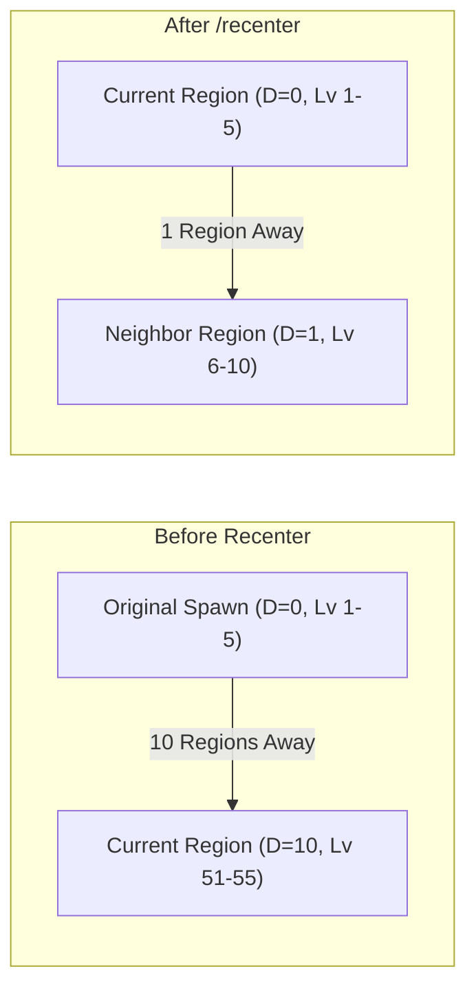

# Feature: The `/recenter` Command

The `/recenter` command is a vital mechanic in **CubeForge XP Progression** (`xp-progression`) that gives players control over their progression center without breaking game balance.

---

## 🧭 Table of Contents
1. [Why Does It Exist?](#why-does-it-exist)
2. [How It Works](#how-it-works)
3. [In-Game Usage](#in-game-usage)
4. [Internal Mechanics & Safeguards](#internal-mechanics--safeguards)

---

## Why Does It Exist?

In `xp-progression`, creature and gear levels increase as you travel further from your starting region based on Chebyshev distance ($D = \max(|X-X_0|, |Y-Y_0|)$).

If you explore 10 regions away from your initial spawn point, enemies will be Level 50+. If you choose to settle in a distant land or build a base there, exploring even further would normally cause levels to climb indefinitely.

The `/recenter` command allows you to set your **current region as the new origin point ($D = 0$)**, resetting the difficulty curve around your new home.

---

## How It Works



When `/recenter` is typed into chat:
1. The player's home region anchor stored in `equipment.unk_item.region` is updated to `current_region`.
2. All subsequent distance calculations ($D$) evaluate to $0$ for the current region.
3. Surrounding regions immediately re-scale relative to the new origin.

---

## In-Game Usage

Simply open the chat window (`Enter`) and type:

```text
/recenter
```

### Expected Output
- A green chat notification will confirm: `[Notification] Correctly recentered player region.`
- The HUD region banner in the top-right corner will update its level bracket (e.g., to `LV.1-5 <Region Name>`).

---

## Internal Mechanics & Safeguards

### Anti-Abuse Health Management
When the world recenters, enemy levels drop, which could theoretically cause HP glitching. `xp-progression` handles this with a special entity loop:

```cpp
// Reset HP of all creatures
for (cube::Creature* creature : game->world->creatures)
{
    if (creature->entity_data.hostility_type == cube::Creature::EntityBehaviour::Player)
    {
        // To ensure this command is not misused as a full heal:
        creature->entity_data.HP = std::min<float>(creature->GetMaxHP(), creature->entity_data.HP);
    }
    else
    {
        creature->entity_data.HP = creature->GetMaxHP();
    }
}
```

- **Player HP**: Clamped to the new max HP so the command cannot be used as an invulnerability or full-heal exploit in combat.
- **Creatures**: Restored to their new maximum HP to match their adjusted level.
